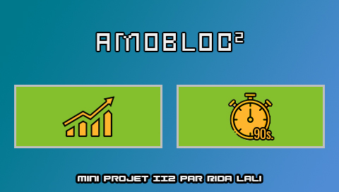

# Projet Amobloc²

*Projet d'Informatique Industrielle mené par Rida LALI dans le cadre du module 442-ENS du M1 E3A*

*Utilisation d'une carte STM32 pour implémenter une mini-borne d'arcade utilisant divers supports*

Ce projet a pour but de réinvestir un maximum de connaissances du cours d'Informatique Industrielle dans le but de faire un système embarqué utilisant divers supports et en particulier, 
un Timer Software (dont le topic a été présenté lors d'une séance de soutenances).

Ce README fait une review de ce que contient le projet à l'heure actuelle.

## Le jeu

Vous contrôlez le personnage du jeu Among Us, et le but est d'esquiver les blocs
qui tombent du ciel. Pour cela, vous contrôlez le personnage horizontalement à
l'aide du Joystick de la carte.

## Un jeu, deux modes
### Mode Libre
Le but est de faire le plus gros score, aucune limite de temps n'est imposée.

### Mode Timer
En un temps limité que vous réglerez avant le début de la partie à l'aide du potentiomètre
gauche, vous devez esquiver tous les blocs. Le jeu s'arrêt lorsque le temps est écoulé ou
lorsque vous perdez. 

Le but de ce mini-projet réside dans ce mode où est utilisé un Software Timer.
(Plusieurs fonctions de FreeRTOS sont exploitées : xTimerStart, xTimerStop, xTimerReset)

 
